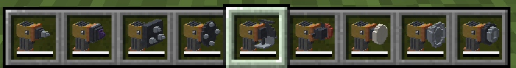

# Create: Pneumatic Tools

Nine handheld tools that run off a Create backtank.

**Minecraft 1.21.1 · NeoForge 21.1.219+ · Create 6.0+**


A Copper Backtank is already a portable power supply — Create just spends it on breathing and on the
Extendo Grip. This addon spends it on work. Most of what Create does with rotation to a block bolted
to the ground it could do to a block in front of you, so the Mechanical Drill, the Mechanical Saw
and the Hand Crank each get a version you hold, and the gaps between them are filled with the tools
an actual workshop has: a jackhammer, a grinder, a buffer, a vacuum.

Nothing here is a new mechanic. Every tool spends air through Create's own `BacktankUtil`, at a
"uses per tank" rating in the same unit Create rates its own equipment in.

Every tool is a **3D model with a part that moves** — a pistol-grip body with the working end
pointing where you are aiming it. Bits, impellers and sockets turn on the barrel, blades and wheels
spin on a spindle across it, and the jackhammer's chisel recoils and strikes. They idle while you
carry them, spool up when you put them to work, and stop when the tank runs dry, so an empty
backtank is something you see in your hand before you swing at anything.



---

## The tools

### Mining and harvesting

| Tool | What it does | Per tank |
|---|---|---|
| **Hand Drill** | A Mechanical Drill you can carry. Quick on anything a pickaxe or a shovel handles. | 900 blocks |
| **Pneumatic Jackhammer** | Shatters hard blocks in a fixed quarter-second — Obsidian and Deepslate take the same moment. Netherite tier. Slow and **free** on anything soft. | 90 hard blocks |
| **Tunnelling Drill** | Clears a 3x3 slice lying flat against the face you drilled — a wall if you drilled a wall, a trench if you drilled the floor. Charged once per burst, however many of the nine blocks were there. | 100 bursts |
| **Pneumatic Borer** | The same burst five blocks across instead of three — twenty-five at a time. Wider and slower, out of half as many bursts a tank. Built in a Mechanical Crafter. | 50 bursts |
| **Pneumatic Saw** | Fells a whole tree from one log, canopy and all. Bamboo, cane, cactus and chorus too. | 60 trees |

### Surface treatment

| Tool | What it does | Per tank |
|---|---|---|
| **Pneumatic Grinder** | Strips bark from a log, scrapes one stage of oxide off copper, takes the wax off a sealed block. | 300 surfaces |
| **Pneumatic Buffer** | Seals copper with the wax built into it — no Honeycomb to carry. | 300 blocks |

### Power and pickup

| Tool | What it does | Per tank |
|---|---|---|
| **Pneumatic Vacuum Wand** | Hold Right-Click and loose items and experience come to you from eight blocks out. A pulse with nothing in range is free. | 900 pulses |
| **Pneumatic Wrench** | Portable torque. Hold it against a still shaft and it drives the network at 64 RPM with 1024 SU behind it — twice a Hand Crank's speed and four times its torque. Held against a network already turning, it matches that network's speed and direction and lends the same 1024 SU. | 450 pulses |

---

## How the air works

Wear a **Copper Backtank** (or a Netherite one) and the tools work. Take it off and they do not —
there is no durability to fall back on, and the bar under a tool in your hotbar is the tank's charge,
not the tool's.

Costs are stated as **uses per tank**, which is the unit Create already uses for the Extendo Grip
(1000 actions) and the Potato Cannon (200 shots), so these numbers can be read straight against
Create's own. A rating becomes a cost the way Create's does: `airInBacktank / usesPerTank`, charged
against the *emptiest* tank you are wearing — so a second backtank is a second tank, not a spare.

Two tools charge only for what they are for, which is deliberate rather than an oversight:

- The **Jackhammer** charges nothing on a soft block, and gives no speed there either. The air is
  what does the shattering.
- The **Saw** charges per *tree*, not per log. Chopping a plank is free.

The **Wrench** is the odd one out and worth explaining. Create's rotation is a graph of block
entities, so a source of it has to *be somewhere* — an item in a hand cannot join a kinetic network.
So while you hold the button the wrench keeps an invisible generator block in the empty space against
the face you aimed at, exactly where you would have placed a motor by hand. It holds a short lease
that only the wrench renews, so letting go, walking away, switching item, dying, disconnecting or
crashing all end it the same way: the renewals stop and the block deletes itself.

It also **never fights a network that is already turning**. Two generators that disagree about speed
or direction is not a slow network in Create — it is a broken block, and which of the two breaks
depends on which arrived last. So a wrench held against a shaft that is already moving matches that
shaft's speed and direction exactly and contributes only its capacity, which is the case it is most
useful for: a line that is overstressed rather than stopped. Only a still shaft gets the wrench's own
64 RPM, and which way it turns is decided by which face you grab.

**It is worth 1024 SU at any speed.** A backtank breathes at one rate, so the wrench delivers one
amount of power, and the speed it happens to be turning at decides whether that arrives as speed or
as torque — half the RPM, twice the torque. Create bills its own generators the other way, as a fixed
torque whose Stress Units rise with speed, which is right when the generator owns its speed (a Water
Wheel turns at 8 and that is that) and wrong for a tool that can be handed somebody else's: a fixed
16 SU/RPM matched onto a 192 RPM network was worth 3072 SU for exactly the air that buys 1024 on a
shaft of your own.

Everything is configurable in `config/createpneumatictools-server.toml`, including the jackhammer's
break time in ticks and the vacuum's radius. Set any tool's rating to **0** and it becomes free and
needs no backtank at all.

---

## Recipes

Six of the nine are the same shape — a **working head**, a **Brass Sheet**, an **Andesite Alloy**
grip, stacked in a column:

```
 H       H = the working head
 S       S = Brass Sheet
 A       A = Andesite Alloy
```

| Tool | Head |
|---|---|
| Hand Drill | Mechanical Drill |
| Pneumatic Saw | Mechanical Saw |
| Pneumatic Wrench | Hand Crank |
| Pneumatic Grinder | Red Sand Paper |
| Pneumatic Buffer | Honeycomb Block |
| Pneumatic Vacuum Wand | Propeller |

The Grinder's head is Red Sand Paper because it takes a layer off; the Buffer's is a Honeycomb Block
because the wax it lays down had to come from somewhere, and paying for it once at the bench is what
lets the tool seal a roof without a stack of Honeycomb in your pocket.

The other two are both upgrades of the Hand Drill:

```
 . O .          O = Powdered Obsidian        D D D          D = Mechanical Drill
 O D O          D = Hand Drill               D H D          H = Hand Drill
 . O .                                       D D D
   -> Pneumatic Jackhammer                     -> Tunnelling Drill
```

Nine Mechanical Drills for a tool that breaks nine blocks. The **Pneumatic Borer** carries that rule
one step further, and is the one thing here you cannot make at a workbench — five blocks across is a
recipe five blocks across, so it goes in a **Mechanical Crafter**:

```
 D D D D D      D = Mechanical Drill      (16)
 D P S P D      P = Precision Mechanism    (4)
 D S T S D      S = Brass Sheet            (4)
 D P S P D      T = Tunnelling Drill
 D D D D D
   -> Pneumatic Borer
```

Sixteen more drills for sixteen more blocks. Mechanical crafting recipes are not in the vanilla
recipe book — none of Create's own are either — so look for it in JEI or EMI.

---

## Building

```bash
./gradlew build              # compile + jar
./gradlew runClient          # dev client
./gradlew runServer          # dev dedicated server (needs run/eula.txt)
./gradlew runGameTestServer  # automated in-world tests -- the real check
```

JDK 21. Art and the GameTest template are generated:

```bash
python3 tools/generate_models.py       # every 3D model: chassis, heads, moving parts
python3 tools/generate_textures.py     # the eight material panels
python3 tools/generate_logo.py         # the in-jar badge at 256
python3 tools/generate_logo.py branding/icon-512.png --size 512
python3 tools/generate_structures.py   # the empty GameTest template
python3 tools/check_lang.py            # every tooltip key resolves
```

See [CLAUDE.md](CLAUDE.md) for how the repo is put together and the things that will bite you.

---

## What is not here

Three tools from the original list are not built, each with a write-up in `docs/` explaining why and
what it would take:

- **Pneumatic Track Trolley** (`docs/rail-rider.md`) — buildable on Create's own `TravellingPoint`,
  which follows curves and takes junctions from a look vector. What is unsettled is moving a player
  smoothly, and what to do about Trains already using the track.
- **Pneumatic Stilts** (`docs/pneumatic-stilts.md`) — **dropped**, not deferred. The engineering
  came good — a leased platform under your feet, the wrench's self-deleting trick again — but any
  version of it puts a hidden, temporary, walkable floor in a shared world, and everything standing
  on yours falls when you walk away.
- **The wrench as a portable generator** (`docs/wrench-as-a-generator.md`) — Create's rotation is a
  graph of block entities, so a source of it has to be somewhere. The wrench that shipped puts a
  leased, invisible generator against the face you aim at, and keeps renewing it while you hold the
  button.

## Licence

MIT — see [LICENSE](LICENSE). Third-party notices are in [NOTICE.md](NOTICE.md). No Create art is
used or derived from; every sprite here is generated by this repo's own tooling.
